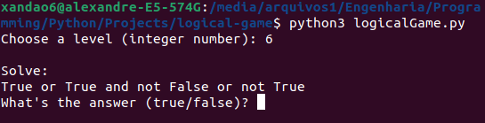
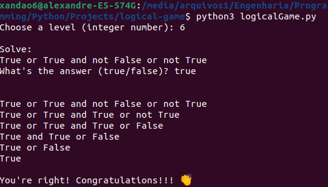

<br />
<p align="center">
  <h3 align="center">Logical Game</h3>

  <p align="center">
    I'ts a game about logical operations, you just need to choose a level that will correspond to the number of operations you have to think of. After you respond to the game will show a step by step explanation of the operation.
    <br />
	  <br />
    <a href="https://github.com/xandao-dev/logical-game"><strong>Explore the docs »</strong></a>
    <br />
    <a href="https://github.com/xandao-dev/logical-game/issue">Report Bug</a>
    ·
    <a href="https://github.com/xandao-dev/logical-game/issues">Request Feature</a>
  </p>
</p>


<!-- TABLE OF CONTENTS -->
<details open="open">
  <summary>Table of Contents</summary>
  <ol>
    <li>
      <a href="#about-the-project">About The Project</a>
      <ul>
        <li><a href="#features">Features</a></li>
        <li><a href="#built-with">Built With</a></li>
      </ul>
    </li>
    <li><a href="#usage">Usage</a></li>
    <li><a href="#roadmap">Roadmap</a></li>
    <li><a href="#contributing">Contributing</a></li>
    <li><a href="#license">License</a></li>
    <li><a href="#contact">Contact</a></li>
  </ol>
</details>


<!-- ABOUT THE PROJECT -->
## About The Project

<div align="center">
  <a href="https://github.com/xandao-dev/logical-game">
    
	  
  </a>
</div>

### Features

* Logical operators (and, or, not)
* Step by step solution
* Infinite and random levels

### Built With

* [Python3](https://www.python.org/) - A general-purpose, high-level programming language
* [random](https://docs.python.org/3/library/random.html) - A library for generating random numbers


<!-- USAGE EXAMPLES -->
## Usage

* Run the game

	```sh
  python3 logicalGame.py
  ```

<!-- ROADMAP -->
## Roadmap

See the [open issues](https://github.com/xandao-dev/logical-game/issues) for a list of proposed features (and known issues).


<!-- CONTRIBUTING -->
## Contributing

Contributions are what make the open source community such an amazing place to be learn, inspire, and create. Any contributions you make are **greatly appreciated**.

1. Fork the Project
2. Create your Feature Branch (`git checkout -b feature/AmazingFeature`)
3. Commit your Changes (`git commit -m 'Add some AmazingFeature'`)
4. Push to the Branch (`git push origin feature/AmazingFeature`)
5. Open a Pull Request

<!-- LICENSE -->
## License

Distributed under the MIT License. See [LICENSE](./LICENSE.md) for more information.

Free software =)


<!-- CONTACT -->
## Contact

Alexandre Calil - [Linkedin](https://www.linkedin.com/in/xandao-dev/) - [alexandre@xandao.dev](mailto:alexandre@xandao.dev)

Project Link: [https://github.com/xandao-dev/logical-game](https://github.com/xandao-dev/logical-game)
